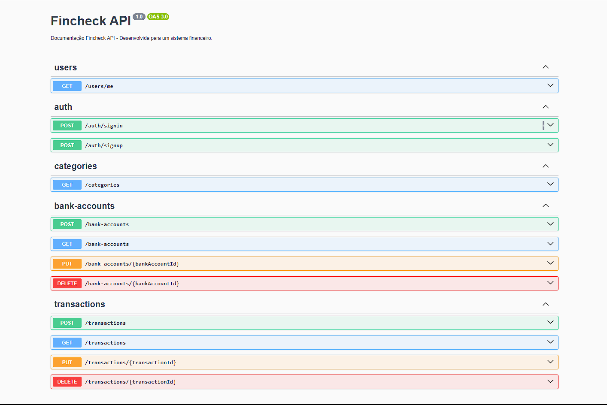
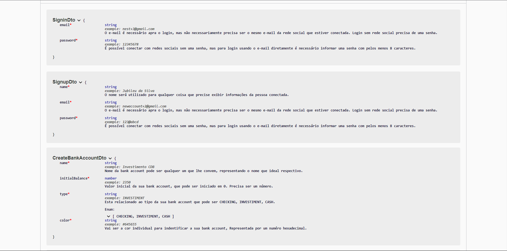
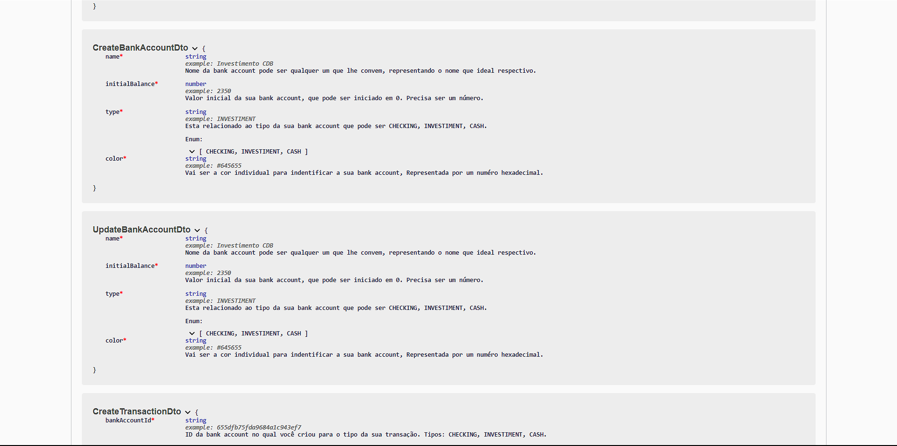

<div align='center'>
<a href="http://nestjs.com/" target="blank"></a>
<h1>Fincheck - API</h1> 
</div>

### Descrição
Bem-vindo à API desenvolvida durante o curso JStack, uma plataforma de aprendizado que se concentra nos fundamentos do [Nest.js](https://github.com/nestjs/nest). Esta API foi meticulosamente construída com o objetivo de fornecer uma base sólida para um sistema financeiro eficiente.

Principais recursos:
- Estrutura Robusta: A API é cuidadosamente estruturada, seguindo as melhores práticas do Nest.js para garantir uma base sólida e escalável.

- Operações CRUD Completas: Todas as operações CRUD (Create, Read, Update, Delete) estão implementadas de forma abrangente nas rotas da API, proporcionando funcionalidades completas para gerenciamento de dados.

- Autenticação Segura com JWT: A autenticação é tratada de maneira segura e eficiente, utilizando JSON Web Tokens (JWT) para garantir a segurança das transações e acessos à API.


### Documentação
Documentação Clara com Swagger: A API vem com uma documentação abrangente, gerada automaticamente pelo Swagger. Isso facilita a compreensão e o uso da API, permitindo uma integração suave para desenvolvedores.

Sinta-se à vontade para explorar a documentação e aproveitar os recursos oferecidos por esta API para impulsionar seus projetos financeiros. Estamos comprometidos em fornecer uma experiência sólida e eficaz para atender às suas necessidades de desenvolvimento.

## 🛠️ Tecnologias

📁 **Back-end**
- [Nest.js](https://github.com/nestjs/nest) 
- [Prisma](https://www.prisma.io)
- [MongoDB](https://www.mongodb.com)
- [Mongoose](https://mongoosejs.com/docs/guide.html)

🔋 **Versionamento e Deploy**
- [Git](https://git-scm.com)
- [Vercel](https://vercel.com/)

<br>

## Installation

```bash
$ npm install
```

## Running the app

```bash
# development
$ npm run start

# watch mode
$ npm run start:dev

# production mode
$ npm run start:prod
```

## Clone

```bash
  # clone project
  $ git clone https://github.com/renovatt/fincheck-api.git
```

## Doc Swagger

```bash
    # swagger documentation
    http://localhost:5000/docs
```





<br>

**Como contribuir?**

- Você pode dar suporte me seguindo aqui no GitHub
- Dando uma estrela no projeto
- Criar uma conexão comigo no linkedin fazendo parte da minha networking e curtir o meu projeto.

<br>

**Autor**
[Wildemberg Renovato de Lima](https://www.linkedin.com/in/renovatt/)